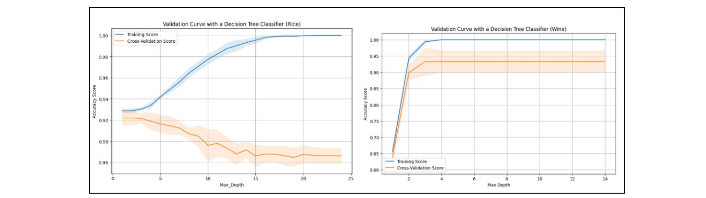

# Supervised Learning: Agricultural Dataset Classification

An exploration of five supervised learning algorithms applied to two agricultural classification datasets, comparing accuracy, training time, and overfitting behavior across varied data structures.

---

## Datasets

Both datasets are sourced from the [UCI Machine Learning Repository](https://archive.ics.uci.edu/ml/index.php) and share an agricultural theme, though they differ considerably in size and structure.

| Dataset | Instances | Features | Task |
|---|---|---|---|
| [Red Wine](https://doi.org/10.24432/C5PC7J) | 178 | 13 (alcohol, malic acid, ash, magnesium, etc.) | 3-class wine cultivar classification |
| [Rice (Cammeo & Osmancik)](https://doi.org/10.24432/C5MW4Z) | 3,810 | 7 (area, perimeter, extent, etc.) | Binary rice variant classification |

All models were trained on a 67/33 train/test split, with 5-fold cross-validation and `GridSearchCV` for hyperparameter tuning. All implementations use **scikit-learn**.

---

## Algorithms

### 1. Decision Trees
Nodes are split using Gini impurity (scikit-learn default). Both pre-pruning (`max_depth`) and post-pruning (`ccp_alpha`) were applied.

- **Rice**: Susceptible to overfitting as depth increases; post-pruning is more effective
- **Wine**: Performs well at depth 3; pre-pruning is the better fit

*Validation curves for max_depth — Rice (left) vs. Wine (right)*

| Dataset | Best `ccp_alpha` | Best `max_depth` | Accuracy |
|---|---|---|---|
| Rice | 2 | 2 | 93.00% |
| Wine | 0.0 | 4 | 96.10% |

---

### 2. AdaBoost
An ensemble approach using `AdaBoostClassifier` over weak decision tree learners. Key parameters: `n_estimators` and `learning_rate`.

- Both datasets plateau around 10 estimators with no meaningful gain beyond that
- Optimal learning rate is ~0.1 for wine; 0.01–0.1 for rice
- Learning curves show convergence and minimal variance — no signs of overfitting

*AdaBoost learning curves showing convergence — Rice (left) vs. Wine (right)*

| Dataset | `n_estimators` | `learning_rate` | Accuracy |
|---|---|---|---|
| Rice | 10 | 0.1 | 92.83% |
| Wine | 10 | 0.1 | 92.43% |

---

### 3. Support Vector Machines (SVM)
Implemented via `SVC`. Two kernels were evaluated — linear and sigmoid — alongside the regularization parameter `C`.

- **Rice**: Linear kernel with C=10 performs best; validation and training converge with minimal overfitting
- **Wine**: Linear kernel generalizes well; sigmoid appeared accurate on paper but showed signs of underfitting

*SVM linear kernel learning curves — Rice (left) vs. Wine (right)*

| Dataset | `C` | Kernel | Accuracy |
|---|---|---|---|
| Rice | 10 | linear | 93.71% |
| Wine | 1 | linear | 97.50%* |

*Wine sigmoid configuration (C=0.1) yielded only 42.55%, reinforcing the preference for linear.

---

### 4. k-Nearest Neighbors (k-NN)
Implemented via `KNeighborsClassifier`. Key parameters: number of neighbors `k` and distance metric `p`.

- **Wine**: Optimal `k` is in the 0–20 range; performance drops significantly beyond that
- **Rice**: Optimal `k` is 8–20; accuracy stabilizes around 91.5–92% and is largely unaffected by `p`
- Both models may benefit from additional training data

*k-NN validation curves for k — Rice (left) vs. Wine (right), note the sharp drop-off in Wine after k=20*

| Dataset | `k` | `p` | Accuracy |
|---|---|---|---|
| Rice | — | — | 93.56% |
| Wine | 43 | 1 | 96.61% |

---

### 5. Neural Networks
Implemented via `MLPClassifier` with two hidden layers (4 nodes each). Key parameters: regularization `alpha` and `learning_rate_init`.

- Loss curves stabilize around 15 epochs for both datasets
- Wine shows more fluctuation in loss but converges to a higher accuracy
- Rice learning curve shows low variance and strong generalization

*Training vs. validation accuracy over epochs — Rice (left) vs. Wine (right)*

| Dataset | `alpha` | `learning_rate` | Accuracy |
|---|---|---|---|
| Rice | 1.27 | 0.008 | 93.33% |
| Wine | 1.43 | 0.078 | **98.31%** |

---

## Summary Comparison

*Side-by-side accuracy comparison across all five algorithms for both datasets*

### Wine Dataset

| Algorithm | Training Time (s) | Accuracy |
|---|---|---|
| Decision Tree | 8.23 | 96.61% |
| AdaBoost | 0.68 | 92.44% |
| SVM (sigmoid) | 1.44 | 92.50% |
| **SVM (linear)** | **0.16** | **97.50%** |
| k-NN | 255.81 | 96.61% |
| Neural Network | 150.54 | 98.31% |

### Rice Dataset

| Algorithm | Training Time (s) | Accuracy |
|---|---|---|
| Decision Tree | 64.61 | 93.00% |
| AdaBoost | 2.53 | 92.82% |
| **SVM (linear)** | **5.90** | **93.71%** |
| SVM (rbf) | 3.30 | 93.35% |
| k-NN | 2302.58 | 93.56% |
| Neural Network | 1003.40 | 93.32% |

---

## Key Takeaways

- **Neural networks** achieved the highest raw accuracy on both datasets, but at significant training cost
- **SVM with a linear kernel** is the best overall choice for both datasets — competitive accuracy with dramatically faster training times (~200x faster than neural networks on wine)
- **k-NN** was by far the slowest to train, particularly on rice (2,300+ seconds), likely due to the larger instance count
- The wine dataset (smaller, more features) showed higher variance across algorithms than rice, where results clustered tightly around 93%

---

## Tech Stack

- Python 3
- [scikit-learn](https://scikit-learn.org/)
- NumPy / Matplotlib

---

## References

1. Aeberhard, S. & Forina, M. (1991). *Wine*. UCI Machine Learning Repository. https://doi.org/10.24432/C5PC7J
2. *Rice (Cammeo and Osmancik)*. (2019). UCI Machine Learning Repository. https://doi.org/10.24432/C5MW4Z